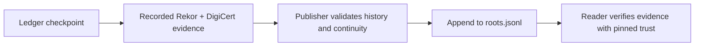

<div align="center">

# INTYGA · Ledger roots

**Public checkpoints for independently verifiable audit history.**

[Download roots](https://raw.githubusercontent.com/intyga-dev/ledger-roots/main/roots.jsonl) · [Publication history](https://github.com/intyga-dev/ledger-roots/commits/main/roots.jsonl) · [INTYGA](https://www.intyga.com)

</div>

---

> **Publication status — 30 September 2026:** the public destination is ready, but
> `roots.jsonl` is still empty. Production root publication has not yet been demonstrated.
> This status concerns this repository; it does not describe whether the production ledger
> already has external anchors.

This repository distributes **INTYGA** ledger checkpoint roots. Anyone can download and retain
these commitments without an INTYGA account or API call, then compare them with audit evidence.

A root is a cryptographic commitment to a checkpoint's audit entries. It contains no audit events.
The file links checkpoints into a continuity chain; verification of external witnesses requires
an evidence bundle and separately trusted verification material.

## Get the roots

```bash
curl --fail --show-error --location \
  https://raw.githubusercontent.com/intyga-dev/ledger-roots/main/roots.jsonl \
  --output roots.jsonl
```

Retain each downloaded snapshot and its Git commit ID. An empty file contains no checkpoints
and cannot establish verification of any event. The download URL follows `main`; use a retained
commit ID in place of `main` when you need a specific published revision.

## How publication works



The configured publisher runs in a separate private deployment repository, scheduled hourly at
**17 minutes past the hour, UTC**. GitHub Actions schedules are best effort. Once activated, it:

1. Reads checkpoint metadata using a dedicated database account with limited read permissions.
2. Checks the full continuity chain and compares previously published rows with the database.
3. Requires recorded evidence from both **Rekor** (`https://rekor.sigstore.dev`) and
   **DigiCert's RFC 3161 timestamp authority** (`https://timestamp.digicert.com`) for each new row.
4. Appends through a dedicated GitHub App, preserving every previously published byte.

The first checkpoint waiting for either witness blocks publication of all later checkpoints.
Conflicting history, a database behind public history, or a conflicting concurrent write causes
the publisher to fail rather than rewrite the file. A quiet ledger may produce no new rows;
file age alone is not a service-health check.

## File format

[`roots.jsonl`](roots.jsonl) contains one JSON object per checkpoint, ordered by `seqEnd`.
Each row has exactly eight fields:

| Field | Meaning |
| --- | --- |
| `seqStart` | First ledger sequence number covered, encoded as a decimal string |
| `seqEnd` | Last sequence number covered, encoded as a decimal string |
| `entryCount` | Number of committed audit entries under this root |
| `root` | Checkpoint Merkle root, as 64 lowercase hexadecimal characters |
| `anchorRef` | Self/Rekor anchor identifier, or `null`; not the complete witness evidence |
| `anchoredAt` | Checkpoint commit timestamp in UTC, with millisecond precision |
| `prevChainHash` | Previous row's `chainHash`; an empty string at the start of the chain |
| `chainHash` | SHA-256 continuity hash defined below |

The DEWP §5.4 continuity hash is:

```text
SHA-256(0x04 || JCS([
  prevChainHash, root, seqStart, seqEnd, String(entryCount), anchoredAt
]))
```

`JCS` is JSON Canonicalization Scheme; `0x04` is a single domain-separation byte. All six array
values are strings. Sequence ranges advance without overlap. Gaps are valid because rolled-back
writes can consume sequence numbers; continuity comes from the linked hashes, not consecutive
sequence numbers.

## Verify a checkpoint

Use an INTYGA CLI build you have reviewed and trust, an exported evidence bundle, and
**independently provisioned Rekor and DigiCert trust material**. With OpenSSL 3 available for
RFC 3161 verification:

```bash
intyga audit-verify evidence.json \
  --roots roots.jsonl \
  --trusted-issuer https://rekor.sigstore.dev,https://timestamp.digicert.com \
  --require-anchors 2 \
  --rekor-key /secure/path/rekor-log-public-key.pem \
  --rekor-issuer https://rekor.sigstore.dev \
  --tsa-trust /secure/path/tsa-trust.json \
  --json
```

The trust files above are prerequisites, not files supplied by this repository. The TSA trust
configuration must cover the DigiCert issuer, including its trusted CA, signer certificate pin
and explicit revocation policy. Never promote a key or certificate from an untrusted proof into
a trust anchor.

Check that verification succeeds and satisfies the two-witness policy. Keep the evidence bundle,
trust configuration and roots snapshot together for later verification. Also compare each new
snapshot with your retained copy: the old bytes must remain an exact prefix. A conflicting or
truncated history requires investigation.

## What the roots establish

| Property | What to expect |
| --- | --- |
| Public discovery | Roots can be fetched independently of the INTYGA API. |
| Continuity | Linked hashes expose missing or changed rows against retained history. They are not an RFC 6962 consistency proof. |
| Witness verification | The publisher checks **recorded** witness evidence; readers must independently verify signatures and timestamp tokens. |
| Evidence retention | This file is neither the full witness evidence nor a backup of audit events. Retain evidence bundles separately. |
| Repository durability | Git history supports comparison and mirroring. Administrators can still rewrite or delete it; GitHub is not WORM storage or an independent witness. |

A database owner could forge an internally consistent new suffix. Publishing that suffix here
would not make it independently verified. Chain consistency, retained history and externally
verified evidence serve different purposes; use them together.

## Public data and privacy

No audit events, identities, receipts, customer names or tenant IDs are published here.
**Exact counts, sequence ranges and timestamps do reveal aggregate service activity.** With few
tenants, a tenant that knows its own event count may infer the combined activity of other tenants
by subtraction. Sequence gaps can also reveal consumed but uncommitted sequence numbers.

Treat published metadata as permanently public: readers may retain independent copies even if
this repository later changes.
